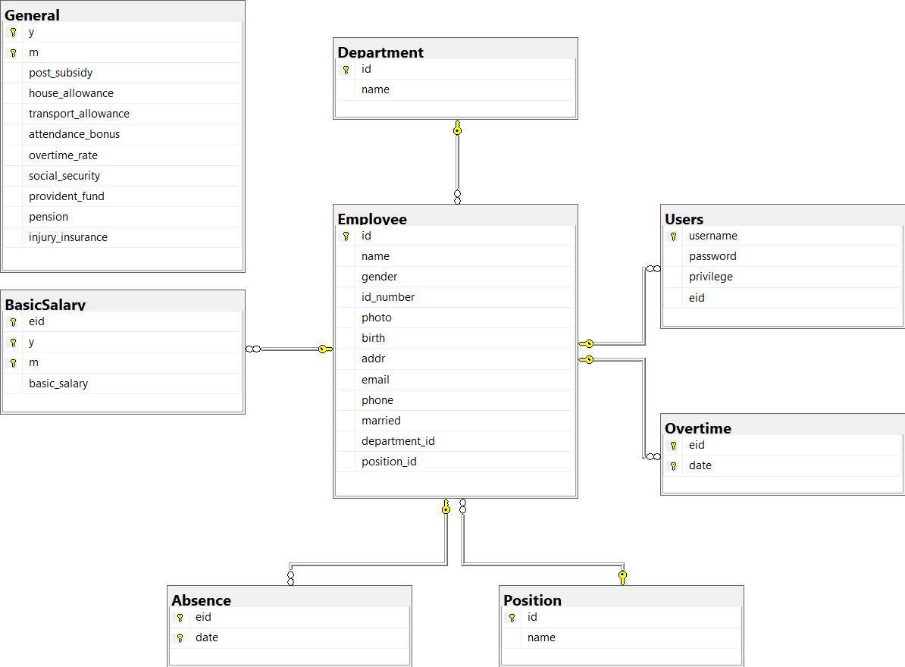
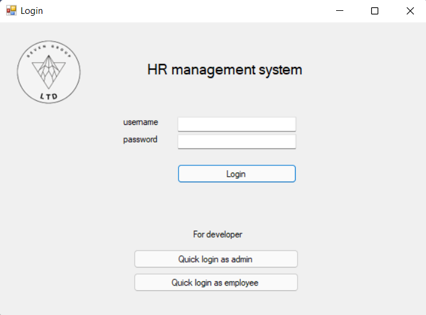
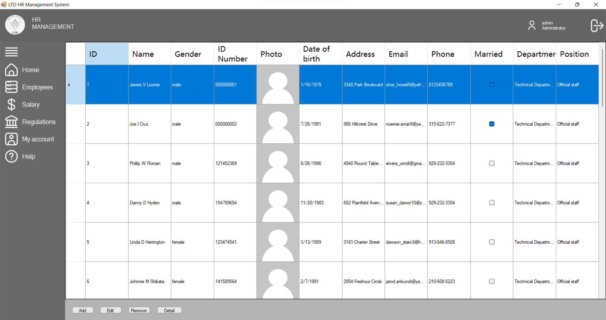
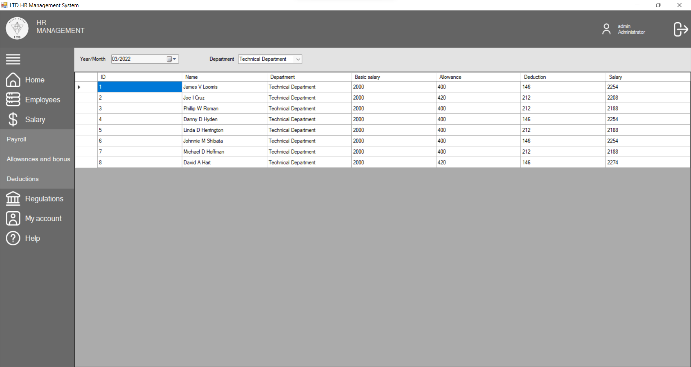
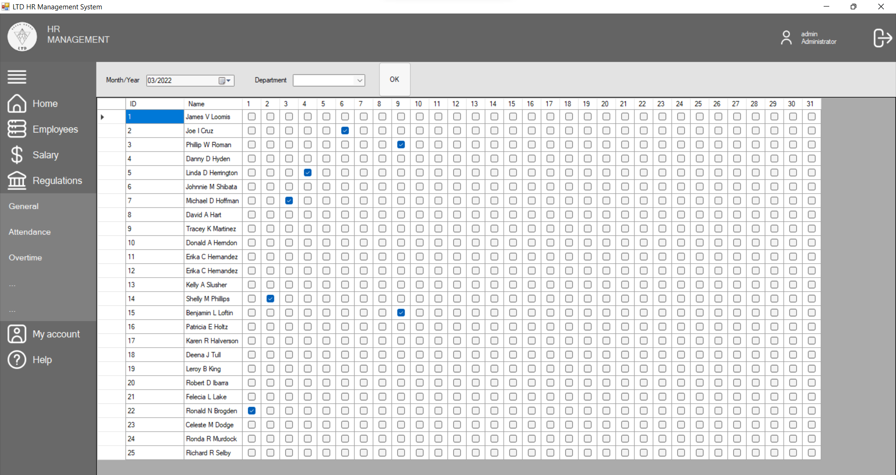

# Employee and salary management system

## How to install
1. Install MS-SQL and execute file `HR.sql`
2. Open solution and edit connectionString in `App.config`

## Database design

## Screen shoot

